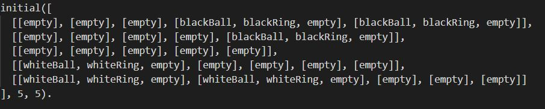
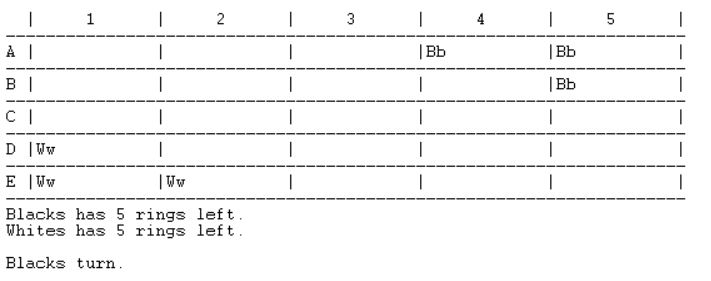
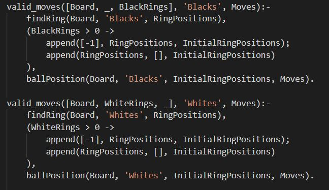
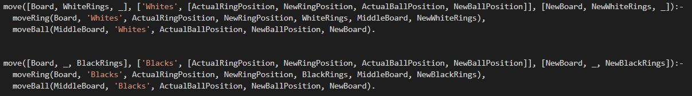
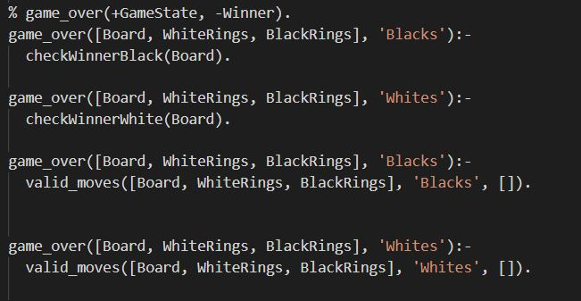
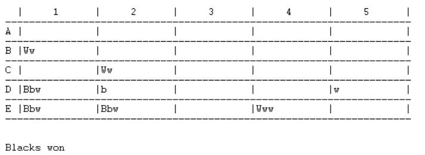
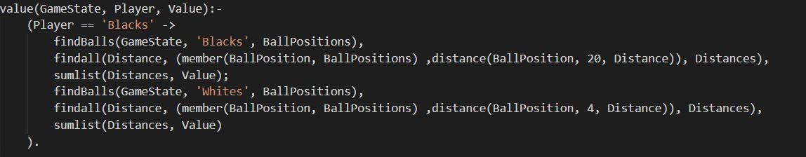
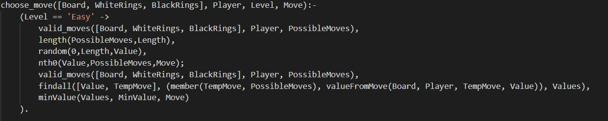

# MITSUDOMOE
PLOG_TP1_RI_T4_Mitsudomoe3

Turma 4:
- Ricardo Filipe da Silva Néri Marques Carvalho (up201806791)
- Xavier Ruivo Pisco (up201806134)

---

## Instalação e execução

Para correr o programa em ambiente Windows, abrir um terminal SICSTUS Prolog, clicar em 'File', carregar o ficheiro 'game.pl', e seguidamente
fazer o seguinte comando 'play.'.

Para correr o programa em ambiente Linux, abrir um terminal, fazer cd até ao diretório do jogo e correr o programa SICSTUS, escrever consult('game.pl'). e correr o programa chamando o predicado play.

Depois, é só escolher a opção de jogo que quer de entre as 4 disponíveis.

## Descrição
Coloque pedras (anéis) para o seu trio (bolas) andar e saltar o caminho para o canto oposto. O oponente vai poder ocupar os seus anéis e saltar por cima das suas bolas enquanto tenta chegar ao seus canto do tabuleiro.

Todas as bolas têm de ser colocadas por cima de anéis do mesmo jogador.

[Livro de regras](https://nestorgames.com/rulebooks/MITSUDOMOE_EN.pdf)

---

## Lógica do Jogo

### Representação interna do estado do jogo

O tabuleiro é criado usando uma lista de listas, sendo estas últimas constituídas por uma lista de símbolos. Os símbolos são posteriormente
convertidos em caracteres, para depois poderem ser vistos no ecrã.

Significado dos átomos:
   - empty -> ' '
   - whiteBall -> 'W'
   - blackBall -> 'B'
   - blackRing -> 'b'
   - whiteRing -> 'w'

#### Tabuleiro inicial

#### Tabuleiro intermédio

#### Tabuleiro final

### Visualização do estado do jogo

O tabuleiro é representado linha a linha, a primeira linha é uma linha de referência, tal como o primeiro caracter de cada coluna.

As restantes linhas do tabuleiro são representadas através de chamadas ao predicado [printLine(Lista)](display.pl#L38). Por sua vez cada posição de uma determinada linha é representada na consola através de uma chamada ao predicado [printStack(Lista, N)](display.pl#L23). Neste predicado são escritos os caracteres correspondentes aos símbolos guardados em cada posição do tabuleiro, sendo preenchido o resto da posição com espaços para manter o tabuleiro formatado.

### Lista de jogadas válidas

[valid_moves(+GameState, +Player, -ListOfMoves).](bot.pl#L4)

A avaliação de jogadas válidas é feita pelo predicado valid_moves, conforme especificado no guião do trabalho.

Este predicado está escrito por duas vezes, uma para cada jogador, e a sua função é verificar se no tabuleiro existe algum anel pertencente ao jogador sem nenhuma bola no topo,
ou se ainda resta algum anel de fora para o jogador colocar no tabuleiro. Caso haja, a lista Moves será unificada com todos as jogdas possíveis para o jogador, caso contrário, o jogador perde o jogo, visto que não poderá mexer nenhuma bola.

### Execução de jogadas

[move(+GameState, +Move,-NewGameState).](bot.pl#L13)

A execução de jogadas, verificando previamente as jogadas possíveis, é feita pelo predicado move, também especificado no guião.

O predicado move só tem como finalidade mover o anel e a bola de um jogador de uma posição para outra. Essas posições são fornecidas pelo utilizador durante o jogo, e essa jogada é analisada previamente para saber se é possível ou não, e se for, o move tratará de mexer o anel e bola respetiva, para a posição dada pelo jogador.

### Final do Jogo

[game_over(+GameState, -Winner).](game.pl#L107)

Um jogador de mitsudomoe pode ganhar o jogo de duas maneiras, chegar com as suas bolas às posições iniciais das bolas do adversário, ou, fazer com que o adversário não tenha nenhum movimento possível.

O predicado game_over está divido em quatro partes, duas para cada jogador e, em cada jogador, uma para cada maneira de ganhar. Para isso, o predicado recebe um GameState, composto pelo Board, WhiteRings e BlackRings, de modo a fazer as verificações necessárias para avaliar se o jogo já acabou ou não. No caso do predicado game_over ser verdadeiro, a variável Winner vai ter o valor 'Blacks' ou 'Whites' de acordo com o vencedor do jogo.

### Avaliação do Tabuleiro

[value(+GameState, +Player, -Value).](bot.pl#L88)

O predicado values avalia a pontuação de um jogador num determinado momento. Como o nosso jogo não envolve pontuações,
decidimos pontuar um jogador consoante a distância das suas bolas ao canto adversário(Posição 20).

Dado um jogador, o findBalls encontrará as posições das bolas pertencentes ao jogador e põe-nas numa lista.Seguidamente, usando um findall, a distância de uma certa bola ao canto adversário é calculada, e inserida numa lista, que conterá as 3 distâncias das 3 respetivas bolas à posição 20. No final, usando o predicado sumlists, obtemos o valor total da distância, valor esse que representará
a pontuação do jogador naquele momento. Vale lembrar novamente que esta pontuação é fictícia, porque o jogo em si não contém pontuações.

### Jogada do Computador

[choose_move(+GameState, +Player, +Level, -Move).](bot.pl#L56)

Para o computador efetuar uma jogada é utilizado o predicado choose_move de modo a escolher qual o movimento que deve executar numa determinada situação.

Para escolher esse movimento o predicado recebe como parâmetros um GameState, constituido pelo Board, WhiteRings e BlackRings, o jogador que o bot representa, 'Blacks' ou 'Whites', e uma dificuldade, 'Easy' ou 'Hard'. A variável Move vai ter valor de acordo com os movimentos possíveis de realizar pelo bot e com a dificuldade.

No caso da dificuldade 'Easy' o computador escolhe aleatoriamente entre todas as jogadas possíveis. Quando a dificuldade é 'Hard', o computador avalia todas as jogadas e executa a melhor jogada numa dada situação.

---

## Conclusões

Todas as funcionalidades do trabalho foram devidamente testadas e estão a funcionar corretamente. Apesar disso, não implementámos uma regra do mitsudomoe. No jogo original ao 'saltar' por cima de uma bola de outro jogador, a pessoa que fez o salto tem obrigatoriamente de mudar a posição da bola pela qual passou. No caso de não ser possível mover essa bola a jogada não é válida.

Uma possivel melhoria ao trabalho teria como objetivo implementar a regra não implementada referida anteriormente e melhorar a 'inteligência' do computador, no caso da dificuldade 'Hard', ao prever possíveis respostas do adversário à cada uma das jogadas possíveis.

## Bibliografia

 - Documentação do SICStus - https://sicstus.sics.se/sicstus/docs/latest4/html/sicstus.html/
 - Documentação do SWI Prolog - https://www.swi-prolog.org/pldoc/doc_for?object=manual
 - Moodle da disciplina - https://moodle.up.pt/course/view.php?id=1476